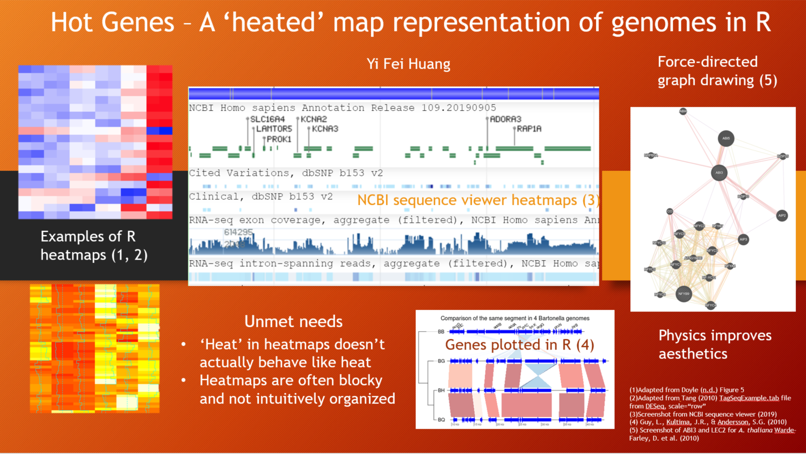
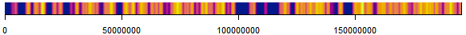

# hotgenes

## Description

The goal of hotgenes is to take as input RNA-seq data (aligned with Rsubread and counted using featureCounts) and create a plot of the genome of a selected area of the data. The visualization is adjusted using a simulation of heat conduction to fill in the gaps between exons to give a rough idea where the 'hotspots' of expression are in the selected area.

## Installation

You can install the latest version of hotgenes from github using the following code:

``` r
library(devtools)
install_github("hyf97ca/hotgenes",  build_vignettes = TRUE)
library(hotgenes)
```

## Overview


This package contains six functions that form the end of a pipeline, for displaying RNA-seq data. The user should have a featureCounts output data
structure to start with (one is included with package as example data). 

The generateStrandModel() function creates a data structure for further processing. rebuildStrandModel() is much faster because it uses an existing strandModel to build another, smaller strandModel that represents less DNA; it is mostly only useful for the shiny app. 

generateLocationModel() is a wrapper for a regular sequence generator for making a model of which array cell represents which DNA base pair(s). 

simulateHeatSpread() applies a self-derived 'heat' simulation that makes smaller exons more visible. 

plotHeatedMap() is a plotting function that makes use of the graphics and grdevices package to create a ribbon-like plot representing a strand of DNA and the (modified) RNA-seq values as 'heat' along the strand. The actual values of 'heat' vary greatly with different parameters and therefore are not useful in a legend; this package is mostly for getting the big picture and not for an accurate reading of actual expression levels.

runHotgenes() starts the shiny app, which uses the example dataset. It should be straightforward to modify the shiny script to use your own custom dataset; loading custom datasets in-app can be implemented if requested.



## Contributions

The author of the package is Yi Fei Huang. All code in this package was written from scratch in RStudio by Yi Fei Huang using available package API documentation and examples. The TPM calculation used to normalize the counts was originally proposed by Wagner GP, Kin K, Lynch VJ. The package assumes preprocessing of data by Rsubread and its featurecounts subcomponent. It directly takes in a featureCounts object provided by Rsubread as part of the input. Inspiration for package structure and comments was drawn from Rpt by Boris Steipe. The example data was constructed using instructions from Phipson, B., Doyle, M., & Dashnow, H. using raw data from Fu, N. Y., Rios, A. C., Pal, B., Soetanto, R. et al.

## References

Fu, N. Y., Rios, A. C., Pal, B., Soetanto, R., Lun, A. T. L., Liu, K., . . . Visvader, J. E. (2015). EGF-mediated
 induction of Mcl-1 at the switch to lactation is essential for alveolar cell survival. Nature Cell Biology, 17(4),
 365–375. doi: 10.1038/ncb3117

Hadley Wickham, Jim Hester and Winston Chang (2019). devtools: Tools to Make Developing R Packages Easier. R package version 2.2.1.
  https://CRAN.R-project.org/package=devtools

Liao Y, Smyth GK and Shi W (2019). The R package Rsubread is easier, faster, cheaper and better for alignment and quantification of
  RNA sequencing reads. Nucleic Acids Research 47(8), e47.
  
Phipson, B., Doyle, M., & Dashnow, H. (2017). RNA-seq analysis in R. Retrieved from
  https://bioinformatics-core-shared-training.github.io/RNAseq-R/align-and-count.nb.html

R Core Team (2019). R: A language and environment for statistical computing. R Foundation for Statistical Computing, Vienna, Austria.
  URL https://www.R-project.org/.
  
RStudio Team (2015). RStudio: Integrated Development for R. RStudio, Inc., Boston, MA URL http://www.rstudio.com/.
 
Steipe B. (2018). hyginn/rpt: R package template - Maintenance (Version v1.2.2). Zenodo. http://doi.org/10.5281/zenodo.2529554

Wagner GP, Kin K, Lynch VJ. Measurement of mRNA abundance using RNA-seq data: RPKM measure
 is inconsistent among samples. Theory in biosciences. 2012 Dec 1;131(4):281-5.

Winston Chang, Joe Cheng, JJ Allaire, Yihui Xie and Jonathan McPherson (2019). shiny: Web Application Framework for R. R package
  version 1.4.0. https://CRAN.R-project.org/package=shiny
  
Victor Perrier, Fanny Meyer and David Granjon (2019). shinyWidgets: Custom Inputs Widgets for Shiny. R package version 0.5.0.
  https://CRAN.R-project.org/package=shinyWidgets

## Example
(run rsubread align and featureCounts on your sequenced RNA to get a featureCounts data structure)
``` r
library(hotgenes)
data(musCh1fc)
sm <- generateStrandModels(1, 195471971, musCh1fc, "chr1", "-", 100000)
x <- generateLocationModel(1, 195471971, 100000)
sm <- simulateHeatSpread(sm, 0.001, 1000)
plotHeatedMap(sm, x)
```
