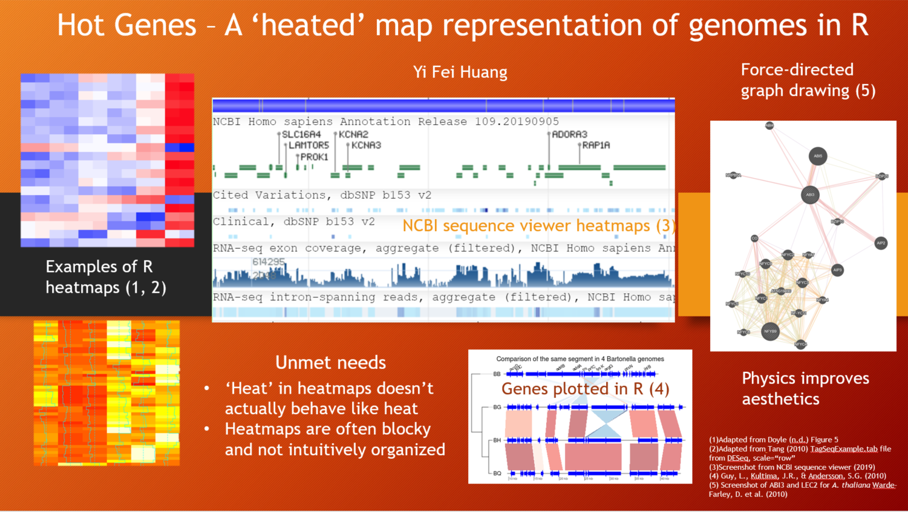

# hotgenes

<!-- badges: start -->
<!-- badges: end -->

The goal of hotgenes is to take as input RNA-seq data and create a plot of the genome of a selected area of the data. The visualization is adjusted using a simulation of heat conduction to fill in the gaps between exons to give a rough idea where the 'hotspots' of expression are in the selected area.

## Installation

You can install the released version of hotgenes from github using the following code:

``` r
library(devtools)
installgithub("hyf97ca/hotgenes")
library(hotgenes)
```

## Pitch


## Example

This is a basic example which shows you how to solve a common problem:

``` r
library(hotgenes)
## basic example code
```

